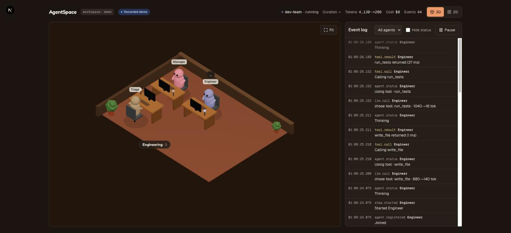
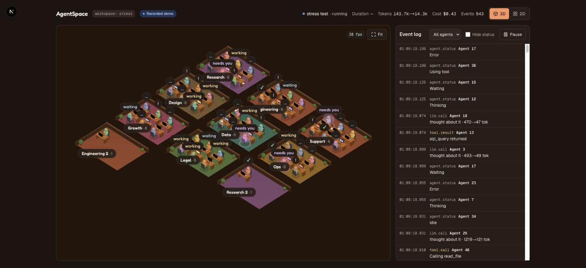

# AgentSpace

**A live office for your AI agent teams.** Add two lines to your multi-agent app and watch every agent work: who is thinking, which tool is running, who handed off to whom, and what it cost.



> 🚧 **Early development: Phase 4 of 5.** Working today:
> - the live 3D office (plus a 2D view), with replay of any stored run;
> - Python and TypeScript SDKs;
> - adapters for LangGraph, CrewAI, the OpenAI Agents SDK, the Claude Agent SDK and Claude Code;
> - OpenTelemetry (OTLP) ingest;
> - approvals, pause and cancel from the office, and auth;
> - a cost dashboard, with list-price estimates clearly marked "est.".
>
> Next: Postgres, benchmarks and releases. See [docs/PROGRESS.md](docs/PROGRESS.md).

## Quickstart

```bash
docker compose up -d                 # collector on :4800, office on http://localhost:4801
```

```bash
pip install agentspace-sdk
```

```python
import agentspace
agentspace.init()                    # LangGraph, CrewAI and OpenAI Agents SDK apps are picked up automatically
```

| Your stack | How to connect it |
|---|---|
| **LangGraph / LangChain**, **CrewAI**, **OpenAI Agents SDK** | `agentspace.init()`. Each uses the framework's official callback, event or tracing hook |
| **Claude Agent SDK** | `options = instrument_options(options)` and `async for m in track(query(...))` (see [example](examples/claude-agent-sdk-support)) |
| **Claude Code** (your own coding sessions) | `python -m agentspace.claude_code install` |
| **Anything with OpenTelemetry** (Vercel AI SDK, OpenLLMetry, OpenInference, …) | `OTEL_EXPORTER_OTLP_TRACES_ENDPOINT=http://localhost:4800/v1/traces`, no SDK needed |
| **TypeScript / JavaScript** | `npm i agentspace-sdk`, then `agentspace.agent({ name }, fn)` ([docs](packages/sdk-ts)) |
| **Anything else** | the manual API: `@agentspace.agent`, `agentspace.step()`, `agentspace.emit()` |

Want to see it without writing any code?

- **Recorded demo:** open http://localhost:4801/demo. It replays recorded runs of every example (pick one from the *Scenario* menu) and needs no collector and no API key.
- **Live example team** (no API key): `cd examples/langgraph-dev-team && uv run python main.py --fake --runs 0`

## What you get

- **A live 3D office.** Each team gets its own room, laid out automatically; desks never move when new agents join. Every agent is a little bean at a desk that animates by status (thinking, typing at a tool, waiting, done, failed). An agent that needs a human glows, and handoffs fly between desks as glowing packets.
- **An agent panel.** Click any agent to see its current step, its tool calls (with durations and failures), tokens, cost, model, and its own live log.
- **Handoffs, tool calls and model calls** in a filterable event log, with token counts and model names.
- **A 2D view** for low-power machines or screen readers. Toggle it in the header; it's used automatically when WebGL isn't available.
- **Run totals**: duration, tokens, cost, and event count.
- **Costs you can trust.** A framework's own billed cost is shown as reported. Where there is none, the collector estimates it from a price table (with the date each price was checked and its official source) and marks it **est.** A cost dashboard shows cost per run, agent, model and day, model latency, the run error rate and the slowest tools.
- **Replay.** Scrub through any stored run at 1x, 4x or 16x and jump straight to errors, handoffs, approvals and pauses.
- **Approvals, pause and cancel from the office**, and optional auth (API keys, an operator token, or public read-only mode).
- **Works with your framework.** LangGraph, CrewAI and the OpenAI Agents SDK are instrumented automatically, and the Claude Agent SDK with two helper calls. All of them use each framework's *official* extension point, so nothing is monkey-patched. There's also plain OpenTelemetry over OTLP, and a TypeScript SDK.
- **Watch your own Claude Code sessions.** Every project gets a room, and subagents get their own desks. Permission prompts glow "needs you".
- **Manual API for everything else**: `@agentspace.agent`, `agentspace.step()`, `agentspace.emit()`.
- **Private by default.** Only metadata and short summaries leave your process. Prompts and outputs are opt-in (`capture_content=True`) and pass through your redaction hook.
- **It can't break your app.** Events are queued in memory and sent by a background thread. If the collector is down, your app keeps running: memory stays bounded and you get one warning. SDK errors are never raised into your code. This is tested, including "kill the collector mid-run" in `make demo-check`.

## How it works

```
 your agent app                         AgentSpace
┌───────────────────────┐   batched    ┌───────────────────┐  WebSocket  ┌───────────────┐
│ LangGraph / manual API│───HTTP──────▶│ Collector         │────────────▶│ Web office    │
│ + agentspace SDK      │  POST        │ SQLite + fan-out  │  snapshot + │ agents, log,  │
│ (background thread)   │  /v1/events  │ Fastify, :4800    │  deltas     │ runs · :4801  │
└───────────────────────┘              └───────────────────┘             └───────────────┘
```

- **[Event spec](spec/README.md)** (JSON Schema, v0.1) is the single source of truth. The Python (pydantic) and TypeScript types are generated from it, and it maps to the [OpenTelemetry GenAI conventions](https://github.com/open-telemetry/semantic-conventions-genai).
- **[Python SDK](packages/sdk-python)** (`pip install agentspace-sdk`, `import agentspace`) has zero runtime dependencies and supports Python 3.10+. Its adapters live in `agentspace/adapters/`.
- **[TypeScript SDK](packages/sdk-ts)** (`npm i agentspace-sdk`) has the same API and the same guarantees, with zero runtime dependencies.
- **Collector OTLP ingest** (`POST /v1/traces`, JSON or protobuf) maps OpenTelemetry GenAI spans to agents ([details](spec/README.md#otlp-ingest-post-v1traces)).
- **[Collector](server)** validates every event against the schema, de-duplicates retries, stores events in SQLite, and streams them to browsers.
- **[Web](web)**: Next.js, Tailwind, and react-three-fiber. Furniture is instanced and labels are one DOM layer, so **50 agents at 100 events/s run at about 60 fps** (production build, MacBook Air; try `/demo?stress=50`).



## Examples

Every example runs without an API key (`--fake`, or `--replay`) and has a real mode.

| Example | Framework | What you'll see |
|---|---|---|
| [langgraph-dev-team](examples/langgraph-dev-team) | LangGraph | Manager → Triage → Engineer fix a seeded bug |
| [crewai-research-desk](examples/crewai-research-desk) | CrewAI | Researcher → Fact Checker → Writer, with a search tool |
| [openai-agents-handoffs](examples/openai-agents-handoffs) | OpenAI Agents SDK | Triage hands off to Billing, which looks up an invoice |
| [claude-agent-sdk-support](examples/claude-agent-sdk-support) | Claude Agent SDK | a subagent, and a refund waiting for your approval |
| [otel-generic](examples/otel-generic) | plain OpenTelemetry | an agent team with no AgentSpace SDK at all |

## Python API

```python
import agentspace

agentspace.init(
    url="http://localhost:4800",      # or AGENTSPACE_URL
    workspace="default",              # or AGENTSPACE_WORKSPACE
    capture_content=False,            # send prompts/outputs? off by default
    redact=lambda field, value: value # applied to content when capture_content=True
)

@agentspace.agent(team="research", role="finds sources")
def researcher(query): ...

with agentspace.run("weekly-report"):
    with agentspace.step("gather"):
        researcher("agent observability")
    agentspace.set_status("waiting", "rate limited")
    agentspace.emit("message", {"text": "hi"}, summary="said hi")
```

`agent`, `run` and `step` work as sync or async context managers, and `agent` also works as a decorator. When one agent calls another, a handoff is recorded.

LangGraph: `config={"metadata": {"agentspace_team": "Engineering"}}` puts a graph's agents in the same team. By default, the team is the graph's name.

### Approvals, pause and cancel

```python
result = agentspace.request_approval_sync("Deploy v1.2 to prod?", {"version": "1.2"}, timeout=300)
if result.approved:
    deploy()
# Fails closed: "rejected" or "timeout" if nobody approves in time or the collector is down.

agentspace.checkpoint()   # a safe point: waits while paused, raises agentspace.Cancelled once cancelled
```

Approve or reject in the office's **Approvals** tab. Pause, resume or cancel a run from the header. `agentspace.Cancelled` subclasses `BaseException`, so `except Exception` won't swallow it. Use `init(cancel_mode="flag")` and `is_cancelled()` if you'd rather poll. Agent and step scopes are safe points too. The adapters add their own safe points: LangGraph does it automatically; OpenAI Agents needs `hooks=ControlHooks()` to pause; CrewAI uses `step_callback=step_checkpoint`; the Claude Agent SDK uses its PreToolUse hook plus `can_use_tool=approval_callback()`.

### Costs

Each `llm.call` event carries its own cost, and `cost_source` says where it came from:

| The event has | The collector | Shown as |
|---|---|---|
| `cost_usd` (a framework reported it, like the Claude Agent SDK's `total_cost_usd`) | keeps it | the number |
| tokens, a model, and no cost | prices it from `server/src/pricing/prices.json` and sets `cost_source: "estimated"` | the number + **est.** |
| `cost_source: "reported"` and no cost (billed on another event) | leaves it alone | (counted in that other event) |
| tokens and a model that isn't in the table | leaves it unpriced and counts it | "no price" |

Each model's prices have an `as_of` date and the official source page. Cache reads and writes (`tokens_cache_read`, `tokens_cache_write`) get their own rates. Add or correct prices with `AGENTSPACE_PRICES_FILE=/path/prices.json` (same shape as `GET /v1/pricing`). Estimates use standard list prices, with no batch, regional or negotiated discounts.

The **Costs** page (`/dashboard`, linked from the office header) reads `GET /v1/workspaces/:ws/stats?since=&until=`.

### Replay

Click **Replay** next to the latest run in the office, or on any run in the Costs page's run table (`/replay?run=<id>`). The office plays the run's stored events at 1x, 4x or 16x. The scrubber marks errors, handoffs, approvals and pause/cancel, with buttons to jump to the next error or handoff. Pauses longer than 3 seconds are shortened. `/demo` plays its recordings the same way.

### Securing the collector

| Variable | Effect |
|---|---|
| `AGENTSPACE_API_KEYS=ws:key,…` | SDKs must send a key for the workspace (`*` = all). |
| `AGENTSPACE_OPERATOR_TOKEN` | Needed to watch, approve, pause and cancel. The browser asks for it (key button). |
| `AGENTSPACE_PUBLIC_READONLY=true` | Anyone can watch. Approval details are hidden and every operator action is refused. |

With none set (the default), a local collector is open.

## Development

Requirements: Node 22+, pnpm 10, [uv](https://docs.astral.sh/uv/), Docker.

```bash
make install        # JS + Python deps
make dev            # collector (:4800) + web (:4801) with hot reload
make test           # pytest + vitest
make lint typecheck # ruff, mypy, eslint, tsc
make gen-types      # regenerate TS + Python types after editing spec/
make demo-check     # compose up, check the pages, approvals + pause/cancel, costs, run example live, kill collector mid-run
# Behind a TLS-intercepting proxy? See CONTRIBUTING.md (optional CA build arg).
make record         # save the latest finished run as the /demo recording
cd packages/sdk-python && uv sync --group crewai   # one framework group at a time for adapter work
```

Repo layout: `spec/` (event schema) · `packages/sdk-python` · `packages/spec-types` (generated TS types) · `server/` (collector) · `web/` (office) · `examples/` · `docs/` (brief, progress, decisions).

## Roadmap

1. ✅ Spec, Python SDK, LangGraph adapter, collector, 2D view
2. ✅ 3D office (react-three-fiber): auto-layout, avatars, handoff animations, agent panel, recorded demo
3. ✅ Adapters for the Claude Agent SDK, CrewAI, the OpenAI Agents SDK and Claude Code hooks; OTLP ingest; TypeScript SDK
4. Human approvals from the office, pause/cancel, auth, cost estimates and dashboard, replay timeline: built, in review (Postgres deferred)
5. Published overhead benchmarks, releases to PyPI and npm, docs site, public demo

## License

[Apache-2.0](LICENSE)
