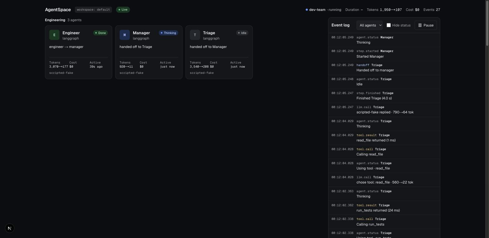

# AgentSpace

**A live office for your AI agent teams.** Add two lines to your multi-agent app and watch every agent work: who is thinking, which tool is running, who handed off to whom, and what it cost.



> 🚧 **Early development: Phase 1 of 5.** Working today: the event spec, the Python SDK with the LangGraph adapter, the collector, and a live 2D view. Coming next: the 3D office. See [docs/PROGRESS.md](docs/PROGRESS.md).

## Quickstart

```bash
docker compose up -d                 # collector on :4800, office on http://localhost:4801
```

```python
import agentspace
agentspace.init()                    # LangGraph graphs are picked up automatically
```

Want to see it without writing any code? Run the example team. It needs no API key:

```bash
cd examples/langgraph-dev-team && uv run python main.py --fake --runs 0
```

## What you get

- **Live status for every agent**: thinking, using a tool, waiting on a human, done, or failed. Agents are grouped into teams automatically.
- **Handoffs, tool calls and model calls** in a filterable event log, with token counts and model names.
- **Run totals**: duration, tokens, cost, and event count.
- **Zero config for LangGraph.** Each graph node becomes an agent. This uses LangChain's official callback hook; nothing is monkey-patched.
- **Manual API for everything else**: `@agentspace.agent`, `agentspace.step()`, `agentspace.emit()`.
- **Private by default.** Only metadata and short summaries leave your process. Prompts and outputs are opt-in (`capture_content=True`) and pass through your redaction hook.
- **It can't break your app.** Events are queued in memory and sent by a background thread. If the collector is down, your app keeps running: memory stays bounded and you get one warning. SDK errors are never raised into your code. This is tested, including "kill the collector mid-run" in `make demo-check`.

## How it works

```
 your agent app                         AgentSpace
┌───────────────────────┐   batched    ┌───────────────────┐  WebSocket  ┌───────────────┐
│ LangGraph / manual API│───HTTP──────▶│ Collector         │────────────▶│ Web office    │
│ + agentspace SDK      │  POST        │ SQLite + fan-out  │  snapshot + │ agents, log,  │
│ (background thread)   │  /v1/events  │ Fastify, :4800    │  deltas     │ runs · :4801  │
└───────────────────────┘              └───────────────────┘             └───────────────┘
```

- **[Event spec](spec/README.md)** (JSON Schema, v0.1) is the single source of truth. The Python (pydantic) and TypeScript types are generated from it, and it maps to the [OpenTelemetry GenAI conventions](https://github.com/open-telemetry/semantic-conventions-genai).
- **[Python SDK](packages/sdk-python)** (`agentspace`) has zero runtime dependencies and supports Python 3.10+.
- **[Collector](server)** validates every event against the schema, de-duplicates retries, stores events in SQLite, and streams them to browsers.
- **[Web](web)**: Next.js with Tailwind. The 2D view is the debug and low-power view; the 3D office comes in Phase 2.

## Python API

```python
import agentspace

agentspace.init(
    url="http://localhost:4800",      # or AGENTSPACE_URL
    workspace="default",              # or AGENTSPACE_WORKSPACE
    capture_content=False,            # send prompts/outputs? off by default
    redact=lambda field, value: value # applied to content when capture_content=True
)

@agentspace.agent(team="research", role="finds sources")
def researcher(query): ...

with agentspace.run("weekly-report"):
    with agentspace.step("gather"):
        researcher("agent observability")
    agentspace.set_status("waiting", "rate limited")
    agentspace.emit("message", {"text": "hi"}, summary="said hi")
```

`agent`, `run` and `step` work as sync or async context managers, and `agent` also works as a decorator. When one agent calls another, a handoff is recorded.

LangGraph: `config={"metadata": {"agentspace_team": "Engineering"}}` puts a graph's agents in the same team. By default, the team is the graph's name.

## Development

Requirements: Node 22+, pnpm 10, [uv](https://docs.astral.sh/uv/), Docker.

```bash
make install        # JS + Python deps
make dev            # collector (:4800) + web (:4801) with hot reload
make test           # pytest + vitest
make lint typecheck # ruff, mypy, eslint, tsc
make gen-types      # regenerate TS + Python types after editing spec/
make demo-check     # compose up, run example, kill collector mid-run, expect exit 0
```

Repo layout: `spec/` (event schema) · `packages/sdk-python` · `packages/spec-types` (generated TS types) · `server/` (collector) · `web/` (office) · `examples/` · `docs/` (brief, progress, decisions).

## Roadmap

1. ✅ Spec, Python SDK, LangGraph adapter, collector, 2D view
2. 3D office (react-three-fiber): auto-layout, avatars, handoff animations, agent panel, recorded demo
3. Adapters for the Claude Agent SDK, CrewAI, the OpenAI Agents SDK and Claude Code hooks; OTLP ingest; TypeScript SDK
4. Human approvals from the office, pause/cancel, replay timeline, cost dashboard, Postgres, auth
5. Published overhead benchmarks, releases to PyPI and npm, docs site, public demo

## License

[Apache-2.0](LICENSE)
